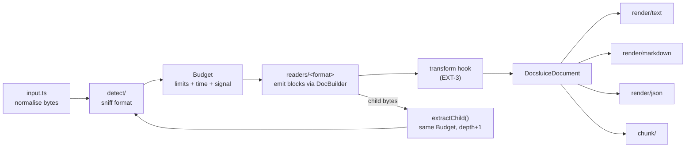

# Architecture

This page is the map. The PRD says *what*; this page says *where* and *how the parts fit*. When an issue creates a module, it uses the path given here.

## Pipeline



## Module map (`packages/docsluice/src/`)

| Path | Job | Requirement IDs |
|------|-----|-----------------|
| `index.ts` | Public exports of the default entry. | RT-4 |
| `core/model.ts` | Output model. **Public contract.** | MOD-1 |
| `core/errors.ts` | Error classes and codes. **Public contract.** | section 12 |
| `core/limits.ts` | `Limits`, `DEFAULT_LIMITS`, `resolveLimits()`. | section 14.2 |
| `core/options.ts` | `ExtractOptions`. **Public contract.** | section 17 |
| `core/budget.ts` | `Budget`: shared counters, time check, abort signal, `onLimit` policy. | SEC-1, SEC-2, SEC-9, SEC-12, NST-1, EXT-1 |
| `core/warnings.ts` | Warning collector, `strict` handling. | section 12 |
| `core/builder.ts` | `DocBuilder`: readers emit blocks through it; it counts output characters, checks block depth, runs `transform` and `onBlock`. | SEC-8, SEC-12, EXT-2, EXT-3 |
| `core/input.ts` | Turn `Uint8Array` / `ArrayBuffer` / `Blob` / web `ReadableStream` into bytes under the input limit. | IN-1 |
| `core/registry.ts` | Reader registry: built-in readers by lazy `import()`, plugin readers by `registerFormat`. | RT-4, EXT-4, EXT-7 |
| `core/extract.ts` | `extract()` and `extractChild()`: the pipeline. | section 6, section 11 |
| `detect/` | `sniff.ts` (magic bytes), `zip-kind.ts` (DOCX vs XLSX vs ODT vs EPUB), `text-kind.ts` (JSON / XML / HTML / CSV / MD / TXT), `encoding.ts`, `detect.ts` (public `detect()`). | IN-4..IN-9 |
| `zip/` | Own zip reader on fflate inflate. `openZip()`. | SEC-1..SEC-3, ADR 0005 |
| `xml/` | Own XML tokenizer and small tree builder. `parseXml()`. | SEC-4, SEC-5, ADR 0008 |
| `ole/` | OLE compound file reader for DOC / XLS / PPT / MSG. | R2 |
| `ooxml/` | Shared OOXML helpers: relationships, content types, core/app properties, theme-free style lookup. | DOC, XLS, PPT |
| `readers/<format>/index.ts` | One reader per format. Exports a `Reader`. | section 8 |
| `render/text.ts`, `render/markdown.ts`, `render/json.ts`, `render/records.ts` | Pure renderers. | REN-1..REN-5 |
| `chunk/` | `chunk()` strategies. | CHK-1..CHK-4 |
| `node/index.ts` | `docsluice/node`: `extractFile()`, Node `Readable` input. | IN-2 |
| `node/worker/` | `docsluice/worker`: isolation in a worker thread with memory cap. | SEC-13 |
| `node/cli/` | The `docsluice` CLI. | section 18 |

Only `src/node/` may use Node APIs. It has its own `tsconfig.json` with Node types; the rest of `src` compiles with no Node types.

## The reader contract

The issue that builds `core/registry.ts` fixes the exact types. This is the intended shape; keep to it unless that issue records a reason to differ.

```ts
interface Reader {
  id: FormatId;                    // 'docx'
  mimeTypes: readonly string[];
  /** Optional extra check after sniffing. Must be cheap and must not throw on bad input. */
  detect?(bytes: Uint8Array): number; // confidence 0..1
  read(ctx: ReadContext): Promise<void>;
}

interface ReadContext {
  bytes: Uint8Array;
  filename?: string;
  options: ResolvedOptions;        // defaults filled in
  budget: Budget;                  // shared with parent and children
  warnings: WarningSink;
  out: DocBuilder;                 // emit blocks, metadata, features
  path: string;                    // child path prefix for locations ('' at the root)
  extractChild(name: string, bytes: Uint8Array, hint?: { mimeType?: string }): Promise<void>;
  zip?: ZipArchive;                // set when the sniffer already opened the container
  cfb?: CfbArchive;                // reuse the compound-file index opened by detection
}
```

Rules for every reader:

- Never throw on bad input when a partial result is possible. Emit what you have and add an `UNREADABLE_PART` warning. Throw `CorruptFileError` only when nothing could be read.
- Never allocate from sizes written in the file. Grow as you read, under the budget.
- Every location carries `path` from `ctx.path` when inside a child (NST-3).

`DocBuilder` is the only writer for the document model. It normalizes emitted text
to NFC and LF, removes C0 controls other than tab and line feed, trims trailing
horizontal whitespace on each line, and keeps at most one blank line in a run.
The transform hook sees each retained block once, including blocks inside
sections; `onBlock` sees completed top-level blocks in output order. The builder
preflights text as it is staged inside open sections, then charges each completed
top-level tree once against the shared output-character budget. If output is
truncated, finishing unwinds open sections and returns accepted partial content.
If a section or nested list exceeds `blockDepth`, it flattens that
container while retaining its content and emits one `DEPTH_LIMIT` warning. This
structural flattening does not mark output as truncated. With `metadata: false`,
the builder removes authors, custom properties, note authors, and the same
personal fields from extracted child documents.

## The budget

Readers can preserve sheet and slide visibility with
`out.openSection(role, loc, title, { hidden: true })`, or `hidden: 'very'` for
Excel's very-hidden sheets. The builder snapshots this existing model attribute
when the section opens. Readers decide whether to emit hidden sections from
`options.includeHidden`; setting the attribute does not change that policy.

One root `Budget` per top-level `extract()` call. Each child gets a budget view with depth + 1 and the same resource counters, clock and cancellation scope.

| Counter | Limit | On limit |
|---------|-------|----------|
| input bytes | `inputBytes` | always throw |
| uncompressed bytes (all entries, all children) | `totalUncompressedBytes` | `onLimit` |
| ratio per entry above `compressionRatioMinBytes` | `compressionRatio` | always throw |
| zip entries | `zipEntries` | `onLimit` |
| child depth | `childDepth` | list, do not open, `DEPTH_LIMIT` warning |
| XML depth | `xmlDepth` | `onLimit` |
| block depth | `blockDepth` | builder flattens nested sections and lists with `DEPTH_LIMIT` |
| output characters | `outputChars` | `onLimit` |
| cells | `cells` | `onLimit` |
| PDF pages | `pdfPages` | `onLimit` |
| time | `timeMs` | `TimeoutError` |
| caller signal | — | `AbortError` |

`onLimit: 'truncate'` stops the reader cleanly, sets `stats.truncated`, and adds a `TRUNCATED` warning that says what was skipped and how much. `onLimit: 'throw'` throws `LimitExceededError`.

Readers call `budget.tick()` inside long loops. `tick()` checks time and the abort signal cheaply (time is read at most every N calls).

`Budget` keeps shared resource counters private and exposes read-only count getters.

The `toJSON()` renderer uses its own throw-mode budget, with the default limits
for block depth (64), child depth (3), table cells (2,000,000) and rendered
output (20,000,000 characters). It does not reuse or charge the extraction's
budget. Exceeding a renderer cap throws `LIMIT_EXCEEDED` rather than returning
truncated or invalid JSON.
Every counter method accepts a nonnegative safe integer and returns whether work
may continue. Counts include the increment that crossed the limit. The configured
limits are copied when the root budget is created, so later caller mutations do
not change an active extraction's limits. `LimitExceededError.value` is the
configured maximum; truncation warnings report both that maximum and the observed
count, once per limit across the whole extraction.

`checkOutputChars(amount)` preflights staged parser text against the remaining
shared output allowance without charging it. XML scanners use a local cumulative
text count for this check; only the builder charges characters when it emits
blocks. Failed preflights follow the same truncation, warning and throw policy.

`checkUncompressed(amount)` similarly checks a planned archive-part read without
charging a declared size. Detection can reject oversized marker parts before
reading them; only real produced bytes increment the shared uncompressed counter.

Children share counters, warnings, the start time, the signal and the clock-sampling
counter, while XML and block depths are tracked independently in each document.
`tick()` checks the clock on its first call and then once every 1024 calls; it checks
abort on every call. Readers should call it before starting and within their loops.
Each `enterDepth(kind)` must be balanced by `exitDepth(kind)`, including an enter
that returned false. Child depth cannot be decreased below a child's inherent
depth. A child exceeding `childDepth` has `canRead: false`, reports `DEPTH_LIMIT`,
and rejects further counter work, even with `onLimit: 'throw'`: the pipeline lists
such a child without opening it. Other depth limits obey `onLimit`.

`WarningSink` stores warnings in emission order. Supply `new WarningSink({ strict })`
as `BudgetOptions.warnings` to apply the caller's strict policy to all parent and
child warnings. Selected warnings throw `StrictModeError` before being stored.
This error has public code `STRICT_WARNING` and a `warningCode` field; its message
does not include the warning's message or document content.

## Extraction lifecycle

`extract(input, options)` snapshots options and limits, reads the input under the
input-byte allowance, resolves its format, loads that format's reader, finishes
the builder and assigns text offsets. Built-in readers use lazy imports. Missing
readers produce `UnsupportedFormatError`; recognized image and media formats
return empty documents. Detection passes an existing ZIP or CFB index to the
reader, so the container entries are counted once.

Child work runs through a microtask queue rather than recursive file traversal.
`children: 'skip'` omits children, while `'list'` records their names and sizes
without loading readers. Extraction records children in request order, even when
readers run concurrently. Child locations and warnings carry the complete path.
Warnings propagate to ancestors while staying isolated from siblings. A child
failure records a structural error code and generic message; cancellation and
timeouts stop the whole extraction. Ancestor-identical bytes are listed with
`DEPTH_LIMIT`, using a hash and length followed by byte equality to avoid hash
collision false positives.

The container reader charges produced child bytes to the shared uncompressed
allowance. The pipeline does not charge those bytes again as top-level input.
`stats.bytesRead` reports each document's own input size; truncation reflects the
shared resource scope. `stats.durationMs` is the sole time-dependent output field.
Offset assignment checks the existing budget without charging output or cells
again.

A private watchdog handles readers, lazy imports and streams that are awaiting
work when the caller aborts or time expires. Closing extraction also aborts its
private scope, so pending descendants cannot continue after a parent failure.
Readers must still check their budget during synchronous loops: JavaScript timers
cannot interrupt a loop that never yields or checks its budget.

## Determinism

Output JSON has a fixed key order: the order of fields in `model.ts`. `render/json.ts` writes keys in that order and omits `undefined` fields.
