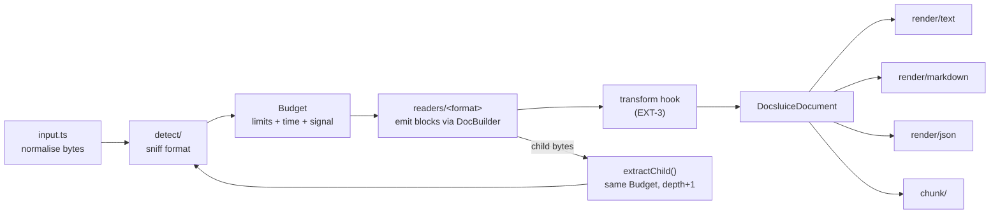

# Architecture

This page is the map. The PRD says *what*; this page says *where* and *how the parts fit*. When an issue creates a module, it uses the path given here.

## Pipeline



## Module map (`packages/docsluice/src/`)

| Path | Job | Requirement IDs |
|------|-----|-----------------|
| `index.ts` | Public exports of the default entry. | RT-4 |
| `core/model.ts` | Output model. **Public contract.** | MOD-1 |
| `core/errors.ts` | Error classes and codes. **Public contract.** | section 12 |
| `core/limits.ts` | `Limits`, `DEFAULT_LIMITS`, `resolveLimits()`. | section 14.2 |
| `core/options.ts` | `ExtractOptions`. **Public contract.** | section 17 |
| `core/budget.ts` | `Budget`: shared counters, time check, abort signal, `onLimit` policy. | SEC-1, SEC-2, SEC-9, SEC-12, NST-1, EXT-1 |
| `core/warnings.ts` | Warning collector, `strict` handling. | section 12 |
| `core/builder.ts` | `DocBuilder`: readers emit blocks through it; it counts output characters, checks block depth, runs `transform` and `onBlock`. | SEC-8, SEC-12, EXT-2, EXT-3 |
| `core/input.ts` | Turn `Uint8Array` / `ArrayBuffer` / `Blob` / web `ReadableStream` into bytes under the input limit. | IN-1 |
| `core/registry.ts` | Reader registry: built-in readers by lazy `import()`, plugin readers by `registerFormat`. | RT-4, EXT-4, EXT-7 |
| `core/extract.ts` | `extract()` and `extractChild()`: the pipeline. | section 6, section 11 |
| `detect/` | `sniff.ts` (magic bytes), `zip-kind.ts` (DOCX vs XLSX vs ODT vs EPUB), `text-kind.ts` (JSON / XML / HTML / CSV / MD / TXT), `encoding.ts`, `detect.ts` (public `detect()`). | IN-4..IN-9 |
| `zip/` | Own zip reader on fflate inflate. `openZip()`. | SEC-1..SEC-3, ADR 0005 |
| `xml/` | Own XML tokenizer and small tree builder. `parseXml()`. | SEC-4, SEC-5, ADR 0008 |
| `ole/` | OLE compound file reader for DOC / XLS / PPT / MSG. | R2 |
| `ooxml/` | Shared OOXML helpers: relationships, content types, core/app properties, theme-free style lookup. | DOC, XLS, PPT |
| `readers/<format>/index.ts` | One reader per format. Exports a `Reader`. | section 8 |
| `render/text.ts`, `render/markdown.ts`, `render/json.ts`, `render/records.ts` | Pure renderers. | REN-1..REN-5 |
| `chunk/` | `chunk()` strategies. | CHK-1..CHK-4 |
| `node/index.ts` | `docsluice/node`: `extractFile()`, Node `Readable` input. | IN-2 |
| `node/worker/` | `docsluice/worker`: isolation in a worker thread with memory cap. | SEC-13 |
| `node/cli/` | The `docsluice` CLI. | section 18 |

Only `src/node/` may use Node APIs. It has its own `tsconfig.json` with Node types; the rest of `src` compiles with no Node types.

## The reader contract

The issue that builds `core/registry.ts` fixes the exact types. This is the intended shape; keep to it unless that issue records a reason to differ.

```ts
interface Reader {
  id: FormatId;                    // 'docx'
  mimeTypes: readonly string[];
  /** Optional extra check after sniffing. Must be cheap and must not throw on bad input. */
  detect?(bytes: Uint8Array): number; // confidence 0..1
  read(ctx: ReadContext): Promise<void>;
}

interface ReadContext {
  bytes: Uint8Array;
  filename?: string;
  options: ResolvedOptions;        // defaults filled in
  budget: Budget;                  // shared with parent and children
  warnings: WarningSink;
  out: DocBuilder;                 // emit blocks, metadata, features
  path: string;                    // child path prefix for locations ('' at the root)
  extractChild(name: string, bytes: Uint8Array, hint?: { mimeType?: string }): Promise<void>;
  zip?: ZipArchive;                // set when the sniffer already opened the container
}
```

Rules for every reader:

- Never throw on bad input when a partial result is possible. Emit what you have and add an `UNREADABLE_PART` warning. Throw `CorruptFileError` only when nothing could be read.
- Never allocate from sizes written in the file. Grow as you read, under the budget.
- Every location carries `path` from `ctx.path` when inside a child (NST-3).

## The budget

One `Budget` object per top-level `extract()` call. Children get the same object, with depth + 1.

| Counter | Limit | On limit |
|---------|-------|----------|
| input bytes | `inputBytes` | always throw |
| uncompressed bytes (all entries, all children) | `totalUncompressedBytes` | `onLimit` |
| ratio per entry above `compressionRatioMinBytes` | `compressionRatio` | always throw |
| zip entries | `zipEntries` | `onLimit` |
| child depth | `childDepth` | list, do not open, `DEPTH_LIMIT` warning |
| XML depth / block depth | `xmlDepth` / `blockDepth` | `onLimit` |
| output characters | `outputChars` | `onLimit` |
| cells | `cells` | `onLimit` |
| PDF pages | `pdfPages` | `onLimit` |
| time | `timeMs` | `TimeoutError` |
| caller signal | — | `AbortError` |

`onLimit: 'truncate'` stops the reader cleanly, sets `stats.truncated`, and adds a `TRUNCATED` warning that says what was skipped and how much. `onLimit: 'throw'` throws `LimitExceededError`.

Readers call `budget.tick()` inside long loops. `tick()` checks time and the abort signal cheaply (time is read at most every N calls).

## Determinism

Output JSON has a fixed key order: the order of fields in `model.ts`. `render/json.ts` writes keys in that order and omits `undefined` fields.
