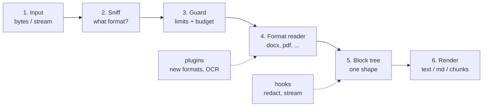

# docsluice — Document Extraction Library (PRD)

> **Source of truth for requirements.** Every issue cites requirement IDs from this file (for example `SEC-1`, `DOC-3`).
> The PRD was written under the working name `docsift`; the project was renamed to **docsluice** on 2026-10-09 (see [ADR 0001](adr/0001-name.md)).
> Open questions in section 26 are resolved in [docs/adr](adr/). When an ADR and this PRD disagree, the ADR wins.

Product requirements document · draft · 2026-10-09 · Name: `docsluice` (free on npm, PyPI and GitHub on 2026-10-09; check again before you publish)

## 1. Summary

People upload files to software all the time. A chatbot gets a spreadsheet. A search index gets a PDF. A support tool gets an email with three attachments. The software must read the words inside these files. This job is called **document extraction**: you put a file in, and you get its text and structure out.

**docsluice** is a JavaScript library that does this one job well. It reads many file formats. It gives one clean result shape for all of them. It is safe to run on files from strangers. It has no native parts, so it runs in Node.js, Bun, Deno, browsers and edge runtimes.

**One line:** `const doc = await extract(bytes)` gives you text, Markdown, tables, page and sheet locations, and metadata from any common office, PDF, web, email or archive file — safely, with limits on, by default.

## 2. The problem

Today a Node.js developer who needs to read uploads must put several libraries together. Each library covers one format. Each has its own output shape, its own error style and its own safety gaps.

A typical upload pipeline shows the problem clearly. To read uploads it uses five separate packages:

| Package | Job | Problem found on 2026-10-09 |
|----|----|----|
| `xlsx@0.18.5` (SheetJS) | Excel | `npm audit` reports high severity (prototype pollution, regular-expression denial of service) with **no fix on npm**. Fixed builds are published only off npm. |
| `pdf-parse@1.1.4` | PDF | Old release that bundles an old pdf.js. Little maintenance. |
| `mammoth` | Word | Good for `.docx` only. Different output shape. |
| `adm-zip` and `yauzl` | Zip | Two libraries for one job. `adm-zip` has a high-severity advisory. |
| Own in-house code | Office XML | A third, partial parser beside the others. |

The result: four output shapes, no shared limits, no shared safety model, and a security finding with no fix. Many other teams have the same stack. The gaps that matter in general:

1.  **No single safe default.** Most parsers trust their input. A small zip can expand to gigabytes (a "zip bomb"). An XML file can call out to other files (an "XXE" attack). Few libraries guard against both.
2.  **Text without structure.** Many tools return one long string. Tables, headings, page numbers and sheet names are lost. Large language model (LLM) apps need that structure to cite sources and to split text into pieces.
3.  **Native or server parts.** Strong tools such as Apache Tika (Java) and Unstructured (Python) need a separate server or runtime. Some npm packages call system programs. These do not run in a browser or an edge function.
4.  **No location data.** An answer that says "page 4" or "Sheet2!B7" builds trust. Most libraries cannot tell you where text came from.

## 3. Goals and non-goals

### Goals

1.  Read the common business formats with one API and one result shape.
2.  Be **safe by default** on untrusted input. Limits are on without any setting.
3.  Keep structure: headings, lists, tables, pages, slides, sheets, cells.
4.  Give a location for every block of text, for citations.
5.  Produce LLM-ready output: Markdown, plain text and token-sized chunks.
6.  Run everywhere JavaScript runs. No native add-ons. No system programs.
7.  Let users add formats and an OCR step (optical character recognition — reading text from images) as plugins.
8.  Be small to install. Let bundlers drop formats an app does not use.

### Non-goals

- **Write or edit documents.** docsluice only reads.
- **Render pages** to images or keep exact visual layout.
- **Convert** one format to another with full fidelity (for example, DOCX to PDF).
- **OCR in the core package.** OCR is large and slow. It comes as an optional plugin.
- **Fetch URLs.** The caller fetches bytes. docsluice never opens a network connection.
- **Run any content**: macros, PDF JavaScript, HTML scripts, formulas. docsluice reports that they exist. It never runs them.
- **A hosted service.** It is a library and a command-line tool (CLI). A server can be built on top by someone else.

## 4. Who uses it

| User | What they need most |
|----|----|
| LLM and RAG app builders (RAG = retrieval-augmented generation: look up text, then hand it to a model) | Markdown output, chunks with locations, tables kept as tables, token budgets. |
| Chatbots that accept uploads | Safety on stranger files, size limits, one call for any file, a redaction hook before text reaches a model vendor. |
| Search indexers | Plain text plus metadata, speed, streaming, low memory. |
| Compliance and data-loss-prevention (DLP) pipelines | Every bit of text, including hidden sheets, comments, speaker notes and attachments. Flags for macros and encryption. |
| Browser and edge apps | No Node-only APIs in the core. Small bundles. |
| Command-line users and scripts | `npx docsluice file.pdf` with Markdown or JSON out. |

## 5. Design principles

1.  **Safe before fast.** When safety and speed disagree, safety wins. Users can raise limits. They cannot forget to set them.
2.  **Pure JavaScript.** No native modules, no WebAssembly in the core, no child processes. (A plugin may use WebAssembly.)
3.  **One model, many renderers.** Every format turns into the same block tree. Text, Markdown, JSON and chunks are views of that tree.
4.  **Partial is better than nothing.** A damaged file gives the text it can, plus warnings. A `strict` mode turns warnings into errors.
5.  **Same input, same output.** Output is byte-for-byte stable for a given version. This makes caching and tests simple.
6.  **Few dependencies.** Each one is a supply-chain risk. Add one only with a written reason.
7.  **Honest about gaps.** If a PDF has no text layer, say "needs OCR". Never return an empty string with no reason.

## 6. How it works

Every file goes through the same six steps.

1.  **Input** — the caller gives bytes or a stream, plus an optional file name and MIME type (the label a browser or server gives a file, such as `application/pdf`).
2.  **Sniff** — docsluice reads the first bytes ("magic bytes") and the inside of zip containers to learn the real format. It does not trust the file name.
3.  **Guard** — every later step runs inside a budget: maximum bytes, time, depth and entries.
4.  **Format reader** — one module per format turns the file into blocks.
5.  **Block tree** — the one shared result shape (section 9).
6.  **Render** — turn the tree into the output the caller asked for.

## 7. Input and detection

Priority key: P0 needed for 1.0 · P1 soon after · P2 later or plugin.

| ID | Requirement | Pri |
|----|----|----|
| IN-1 | Accept `Uint8Array`, `ArrayBuffer`, Node `Buffer`, `Blob`/`File`, and web `ReadableStream`. | P0 |
| IN-2 | Accept a Node `Readable` stream and a file path, only from the Node entry point (`docsluice/node`), so the core stays runtime-neutral. | P0 |
| IN-3 | Take optional hints: `filename`, `mimeType`, `format` (forces a reader and skips sniffing). | P0 |
| IN-4 | Detect format from magic bytes: PDF, zip, OLE compound file (old Office and Outlook `.msg`), RTF, gzip, PNG/JPEG/GIF/TIFF/WebP, and others. | P0 |
| IN-5 | Look inside zip containers to tell DOCX, XLSX, PPTX, ODT, ODS, ODP, EPUB and plain zip apart (via `[Content_Types].xml` and the ODF/EPUB `mimetype` entry). | P0 |
| IN-6 | Tell text formats apart by content: JSON, XML, HTML, CSV/TSV, Markdown, plain text. | P0 |
| IN-7 | Detect text encoding: byte-order mark (BOM), UTF-8, UTF-16 LE/BE, and a fallback to Windows-1252 when bytes are not valid UTF-8. Report the encoding used. | P0 |
| IN-8 | When the name or MIME type disagrees with the content, trust the content and add a `FORMAT_MISMATCH` warning. (A `.pdf` that is really an `.exe` must not be read as a PDF.) | P0 |
| IN-9 | Expose detection alone: `detect(bytes)` returns format, MIME type, confidence and encoding, without full parsing. | P0 |
| IN-10 | Read only as many bytes as a format needs to start; stream the rest where the format allows. | P1 |

## 8. Formats

### 8.1 Coverage by priority

| Group | P0 (1.0) | P1 | P2 / plugin |
|----|----|----|----|
| Text | TXT, Markdown, CSV, TSV, JSON, XML, HTML | YAML, NDJSON, ICS (calendar), VCF (contact), SRT/VTT (subtitles), source code | LaTeX |
| Office (modern) | DOCX, XLSX, PPTX | DOCM/XLSM/PPTM (macro files: text only, flag macros), XLSB | Visio VSDX |
| OpenDocument | — | ODT, ODS, ODP | — |
| Office (legacy binary) | — | XLS (BIFF8), DOC | PPT |
| PDF | PDF text layer | PDF forms and annotations | Scanned PDF via OCR plugin |
| Rich text and books | — | RTF, EPUB | Apple Pages/Numbers/Keynote |
| Email | — | EML (MIME), MSG (Outlook) | MBOX, PST |
| Archives | ZIP | GZIP, TAR | 7z, RAR |
| Images | Detect and report (no text) | Metadata (EXIF dimensions, date — GPS off by default) | Text via OCR plugin |
| Audio/video | Detect and report | — | Metadata; transcript via plugin |

### 8.2 Word documents (DOCX, ODT, DOC)

| ID | Requirement | Pri |
|----|----|----|
| DOC-1 | Read paragraphs in document order, including inside tables, text boxes and content controls. | P0 |
| DOC-2 | Find headings from built-in heading styles **and** from outline levels on custom styles. | P0 |
| DOC-3 | Rebuild list numbering ("1.", "a)", bullets) and nesting from the numbering definitions. | P0 |
| DOC-4 | Read tables with merged cells (horizontal and vertical) and nested tables. | P0 |
| DOC-5 | Read headers, footers, footnotes, endnotes and comments. Each is its own block kind, so callers can keep or drop it. | P0 |
| DOC-6 | Tracked changes: option `revisions: 'accept' | 'reject' | 'show'`. Default `accept` (the text as it would read once all changes are accepted). | P0 |
| DOC-7 | Hyperlinks keep their target URL. Bookmarks and cross-references keep their visible text. | P0 |
| DOC-8 | Images become image blocks with alt text, size and an optional reference to their bytes. | P0 |
| DOC-9 | Hidden text (the "hidden" font flag) is excluded by default and included with `includeHidden: true`. A warning says it existed. | P1 |
| DOC-10 | Field codes (page numbers, dates, mail-merge) give their last shown value, not the code. | P1 |
| DOC-11 | Equations (OMML) become a readable text form; LaTeX form as P2. | P1 |
| DOC-12 | Embedded objects (an Excel sheet inside a Word file) are read as child documents (section 11). | P1 |

### 8.3 Spreadsheets (XLSX, ODS, XLS, CSV)

| ID | Requirement | Pri |
|----|----|----|
| XLS-1 | Read every sheet in workbook order, with its name and state (visible, hidden, very hidden). | P0 |
| XLS-2 | Resolve shared strings, inline strings and rich-text runs. | P0 |
| XLS-3 | Apply number formats to give the value a person sees: dates (both 1900 and 1904 date systems), percentages, currency, thousands separators. Keep the raw value too. | P0 |
| XLS-4 | Formulas: return the **cached value** saved in the file, plus the formula text as an option. Never calculate formulas. | P0 |
| XLS-5 | Merged cells, used range, and sparse sheets (a value in A1 and one in Z90000 must not create 2 million empty cells). | P0 |
| XLS-6 | Limits on rows, columns and cells per sheet and per workbook, with a `TRUNCATED` warning that says how much was skipped. | P0 |
| XLS-7 | Each cell has an address (`Sheet2!B7`) for citations. | P0 |
| XLS-8 | Header-row detection: guess whether row 1 is a header, so Markdown tables and JSON records look right. Can be forced on or off. | P1 |
| XLS-9 | Cell comments and notes, defined names, and Excel tables (ListObjects) by name. | P1 |
| XLS-10 | Hidden rows and columns: included by default (they often hold the data), flagged per row/column. | P1 |
| CSV-1 | Guess the delimiter (comma, semicolon, tab, pipe), handle quoted fields with line breaks, and skip a BOM. | P0 |
| CSV-2 | Stream large CSV files row by row with bounded memory. | P1 |

### 8.4 Slides (PPTX, ODP, PPT)

| ID | Requirement | Pri |
|----|----|----|
| PPT-1 | Slide order comes from the presentation's relationship list, **not** from file names (`slide10.xml` can come before `slide2.xml`). | P0 |
| PPT-2 | Find each slide's title from its title placeholder. | P0 |
| PPT-3 | Read text frames in a sensible reading order (top to bottom, left to right), plus tables, grouped shapes and SmartArt text. | P0 |
| PPT-4 | Read speaker notes as their own block kind. | P0 |
| PPT-5 | Flag hidden slides. Include by default with a flag. | P1 |
| PPT-6 | Read embedded charts' data series as a table. | P2 |

### 8.5 PDF

| ID | Requirement | Pri |
|----|----|----|
| PDF-1 | Extract the text layer page by page, with page numbers and page labels (for example "iv" or "A-3"). | P0 |
| PDF-2 | Put text in reading order: join words into lines, lines into paragraphs, and handle two-column pages. | P0 |
| PDF-3 | Remove repeated headers and footers (the same text at the same spot on most pages) as an option, default on. | P1 |
| PDF-4 | Detect pages with no text layer and report `needsOcr: true` per page. Never return a silent empty result. | P0 |
| PDF-5 | Encrypted PDFs: open with an empty user password if allowed; accept a `password` option; else throw `EncryptedError`. | P0 |
| PDF-6 | Read document metadata, outline (bookmarks) as headings, and link targets. | P0 |
| PDF-7 | Read form fields (AcroForm) as name/value pairs and annotation text (sticky notes). | P1 |
| PDF-8 | Find simple tables (ruled lines or aligned columns). Best effort, marked with a confidence score. | P2 |
| PDF-9 | Handle broken PDFs: rebuild a damaged cross-reference table where possible, and return the pages that work. | P1 |
| PDF-10 | Never run PDF JavaScript and never follow launch or remote actions. | P0 |

### 8.6 HTML and XML

| ID | Requirement | Pri |
|----|----|----|
| HTM-1 | Drop `script`, `style`, `noscript`, `template` and comments. Keep headings, lists, tables, links, code blocks and image alt text. | P0 |
| HTM-2 | Option `mainContent: true` to drop navigation, footers and sidebars (readability-style). | P1 |
| HTM-3 | Decode HTML entities and respect the page's declared character set. | P0 |
| XML-1 | Generic XML gives element text with its path. No DTD processing ever. | P0 |

### 8.7 Email (EML, MSG)

| ID | Requirement | Pri |
|----|----|----|
| EML-1 | Read headers (from, to, cc, date, subject) with encoded words decoded (RFC 2047). | P1 |
| EML-2 | Choose the plain-text body, or turn the HTML body into blocks when no plain body exists. Handle quoted-printable and base64. | P1 |
| EML-3 | Read attachments as child documents, with the same limits (section 11). Inline images are referenced, not inlined. | P1 |
| EML-4 | Option to drop quoted reply history ("On Tuesday, X wrote:"). | P2 |

## 9. Output model

Every format becomes the same tree of **blocks**. A block is one piece of content: a heading, a paragraph, a table, and so on. Each block knows where it came from.

    interface DocsluiceDocument {
      format: string;              // 'docx', 'pdf', ...
      mimeType: string;
      metadata: Metadata;          // title, authors, created, modified, pageCount, language, custom
      blocks: Block[];
      children: ChildDocument[];   // attachments, embedded files, archive entries
      warnings: Warning[];
      stats: { bytesRead: number; durationMs: number; truncated: boolean; needsOcr: boolean };
    }

    type Block =
      | { kind: 'heading';   level: 1|2|3|4|5|6; text: string; loc: Location }
      | { kind: 'paragraph'; text: string; runs?: Run[]; loc: Location }
      | { kind: 'list';      ordered: boolean; items: ListItem[]; loc: Location }
      | { kind: 'table';     rows: Cell[][]; headerRows: number; caption?: string; loc: Location }
      | { kind: 'code';      language?: string; text: string; loc: Location }
      | { kind: 'image';     alt?: string; mimeType?: string; ref?: string; loc: Location }
      | { kind: 'note';      role: 'footnote'|'endnote'|'comment'|'speaker-notes'|'annotation'; text: string; author?: string; loc: Location }
      | { kind: 'header' | 'footer'; text: string; loc: Location }
      | { kind: 'section';   role: 'page'|'slide'|'sheet'|'part'; title?: string; blocks: Block[]; loc: Location };

    interface Location {
      page?: number; pageLabel?: string;   // PDF
      slide?: number;                      // PPTX
      sheet?: string; range?: string;      // XLSX: 'B2:D9'
      path?: string;                       // XML path, zip entry, child doc path
      offset?: [start: number, end: number]; // char offsets into the rendered plain text
    }

| ID | Requirement | Pri |
|----|----|----|
| MOD-1 | The model is a public, versioned, documented contract. A breaking change is a major version. | P0 |
| MOD-2 | Ship a JSON Schema for the model, so non-JavaScript tools can read docsluice JSON output. | P1 |
| MOD-3 | Inline formatting (`runs`: bold, italic, link, code) is optional, off by default, to keep output small. | P1 |
| MOD-4 | Metadata extraction can be turned off as a whole or per field (author names are personal data). | P0 |
| MOD-5 | Report document features found but not run: `hasMacros`, `hasExternalLinks`, `hasEmbeddedFiles`, `isEncrypted`, `hasJavaScript`. | P0 |

## 10. Renderers and chunks

| ID | Requirement | Pri |
|----|----|----|
| REN-1 | `toText(doc)` — plain text with blank lines between blocks and tab-separated table cells. | P0 |
| REN-2 | `toMarkdown(doc)` — GitHub-flavoured Markdown: `#` headings, lists, pipe tables, fenced code, page/slide/sheet markers as headings or comments (option). Escape Markdown characters in source text. | P0 |
| REN-3 | Large tables in Markdown: cap rows and columns, and say how many were left out. | P0 |
| REN-4 | `toJSON(doc)` — the model, stable key order. | P0 |
| REN-5 | `toRecords(table)` — table rows as objects keyed by the header row. | P1 |
| CHK-1 | `chunk(doc, opts)` — split into pieces for search and LLMs. Strategies: by heading section, by page/slide/sheet, by size. Never split inside a table row or a sentence when a nearby break exists. | P0 |
| CHK-2 | Size by characters by default. Accept a caller-given `countTokens(text)` function, so docsluice needs no tokenizer of its own. | P0 |
| CHK-3 | Overlap between chunks (configurable). Each chunk carries its heading path ("Chapter 2 › Pricing") and its source locations. | P0 |
| CHK-4 | Large tables split by rows, and every piece repeats the header row. | P1 |

## 11. Nested files

Files often hold other files. An email holds a zip. The zip holds a Word file. The Word file holds an Excel sheet. docsluice reads them as a tree of **child documents**.

    email.eml
    ├── body (blocks)
    └── children
        ├── report.zip
        │   ├── q3.docx          → blocks
        │   │   └── embedded.xlsx → blocks
        │   └── logo.png         → image, no text
        └── invoice.pdf          → blocks

| ID | Requirement | Pri |
|----|----|----|
| NST-1 | Read children with the **same shared budget** as the parent. A child cannot reset the byte, time or entry limits. | P0 |
| NST-2 | Maximum nesting depth (default 3). Deeper files are listed but not opened, with a warning. | P0 |
| NST-3 | Each child has a path (`report.zip/q3.docx/embedded.xlsx`) used in every location inside it. | P0 |
| NST-4 | Option `children: 'extract' | 'list' | 'skip'`. Default `extract`. | P0 |
| NST-5 | Optional access to raw child bytes (for images sent to OCR or a vision model), off by default to save memory. | P1 |
| NST-6 | Detect a file that contains itself (a recursive zip, "quine") and stop. | P0 |

## 12. Errors and warnings

docsluice separates two cases. A **warning** means "I gave you a result, but something was skipped or odd". An **error** means "I could not give you a useful result".

| Error class | When |
|----|----|
| `UnsupportedFormatError` | No reader for the detected format. Carries the detected format. |
| `EncryptedError` | Password needed and not given, or wrong. |
| `CorruptFileError` | Nothing could be read. |
| `LimitExceededError` | A hard limit was hit and `onLimit: 'throw'` is set. Carries the limit name and value. |
| `TimeoutError` / `AbortError` | Time budget used up, or the caller's `AbortSignal` fired. |

- All errors extend `DocsluiceError` and carry a stable `code` string, so callers can switch on it.
- Warnings are objects: `{ code, message, loc? }`. Codes include `TRUNCATED`, `FORMAT_MISMATCH`, `NEEDS_OCR`, `HIDDEN_CONTENT`, `MACROS_PRESENT`, `DEPTH_LIMIT`, `UNREADABLE_PART`, `ENCODING_GUESSED`.
- `strict: true` turns chosen warning codes into errors.
- Error messages never include document content. They may be logged by the caller, and content can be private.

## 13. Hooks and plugins

| ID | Requirement | Pri |
|----|----|----|
| EXT-1 | `signal: AbortSignal` on every call. | P0 |
| EXT-2 | `onBlock(block)` callback and an async-iterator form (`for await (const block of extractStream(...))`) so callers can stream results and stop early. | P1 |
| EXT-3 | `transform(block)` hook that runs on every block before any renderer. Use cases: redact personal data before text goes to an LLM vendor, normalise whitespace, drop blocks. | P0 |
| EXT-4 | Format plugin API: `registerFormat({ id, mimeTypes, detect, read })`. Plugins run inside the same budget and get the same safe XML and zip helpers. | P0 |
| EXT-5 | OCR plugin interface: `ocr(image, { language }) → { text, confidence, boxes? }`. First-party adapters: `@docsluice/ocr-tesseract` (tesseract.js, local) and a generic "bring your own function" adapter for cloud vision services. | P1 |
| EXT-6 | Export the safe building blocks for others: `openZip`, `parseXml`, `sniff`. They are useful alone. | P1 |
| EXT-7 | Plugin contract has its own version number. docsluice refuses a plugin built for an incompatible contract, with a clear error. | P1 |

## 14. Security

docsluice reads files from strangers. Assume every file was made by an attacker. This section is the most important one in the document.

### 14.1 Threats and defences

| ID | Threat (plain words) | Defence | Pri |
|----|----|----|----|
| SEC-1 | **Zip bomb** — a 40 KB file that expands to many gigabytes. | Count bytes as they decompress. Stop at the total-uncompressed limit and at a compression-ratio limit. Never trust the sizes written in the zip header. | P0 |
| SEC-2 | **Too many entries** — a zip with a million tiny files. | Entry-count limit, checked before reading entries. | P0 |
| SEC-3 | **Path tricks** — entry names like `../../etc/passwd`. | docsluice never writes to disk. Entry names are treated as plain strings and cleaned before they appear in paths. | P0 |
| SEC-4 | **XML external entities (XXE)** — XML that asks the parser to read local files or URLs. | One shared XML parser with DTD, external entities and processing instructions **off and not switchable**. | P0 |
| SEC-5 | **Billion laughs** — XML entities that expand to huge text. | No entity expansion beyond the five built-in XML entities. Element-depth and text-size limits. | P0 |
| SEC-6 | **Prototype pollution** — a key named `__proto__` in a file changes JavaScript objects across the app. (This is SheetJS's open advisory.) | Never use file data as plain-object keys. Use `Map` or `Object.create(null)`. A lint rule and a test file full of `__proto__`, `constructor` and `prototype` keys in every format. | P0 |
| SEC-7 | **Slow regular expressions (ReDoS)** — text built to make a pattern run for minutes. | No regular expression with nested repeats on file data. Static check in CI (for example `eslint-plugin-regexp`). Hand-written scanners for hot paths. | P0 |
| SEC-8 | **Deep nesting** — tables in tables, lists in lists, 10,000 levels deep, to crash the stack. | Depth limit everywhere. Iterative code, not recursion, for tree walks over file data. | P0 |
| SEC-9 | **Endless loops** — PDF objects or zip parts that point at each other. | Visited sets on every reference graph. A global time budget. | P0 |
| SEC-10 | **Network calls** — linked images, remote templates, external relationships in Office files, PDF remote actions. | docsluice never fetches anything. External targets are reported as data only (`hasExternalLinks`). | P0 |
| SEC-11 | **Running content** — macros, PDF JavaScript, HTML scripts, formulas. | Never run. Report presence only. Formula text is returned as a string. | P0 |
| SEC-12 | **Memory exhaustion** — a sheet that claims 1,048,576 × 16,384 cells. | Limits on cells, characters, blocks and decoded image size. Sparse storage for sheets. | P0 |
| SEC-13 | **A crash in one parser takes down the app**. | Optional isolation: `docsluice/worker` runs extraction in a worker thread with a memory cap (Node `resourceLimits`) and kills it on timeout. | P1 |
| SEC-14 | **Supply-chain attack** through a dependency. | Few dependencies, pinned with a lockfile, reviewed on update. No install scripts. Publish with npm provenance. | P0 |

### 14.2 Default limits

These numbers are starting points. Tune them with benchmarks before 1.0. Every limit can be changed per call.

| Limit | Default |
|----|----|
| Input size | 100 MB |
| Total uncompressed bytes (all zip entries, all children) | 500 MB |
| Compression ratio per entry | 100 : 1 (only enforced above 1 MB uncompressed) |
| Zip entries | 10,000 |
| Nesting depth of child documents | 3 |
| XML element depth | 256 |
| Output characters | 20,000,000 |
| Spreadsheet cells (whole workbook) | 2,000,000 |
| PDF pages | 2,000 |
| Time | 60 seconds |

Option `onLimit: 'truncate' | 'throw'`. Default `truncate`: return what was read so far, with a `TRUNCATED` warning. Input size and ratio limits always throw, because a partial bomb is still a bomb.

### 14.3 Security process

- **Fuzzing** — run a coverage-guided fuzzer (for example Jazzer.js) on every reader in CI on each pull request for a short run, and nightly for a long run. A crash, hang or limit breach fails the build.
- **Hostile test corpus** — a folder of known-bad files: zip bombs, XXE samples, prototype-pollution keys, deep nesting, broken PDFs. Every reader must pass all of them.
- **Disclosure** — a `SECURITY.md` with a private reporting channel (GitHub private advisories) and a response target.
- **Releases** — two-factor login on npm, publish from CI only, with provenance; a software bill of materials (SBOM) on each release.

## 15. Privacy

- No telemetry. docsluice sends nothing anywhere. Ever.
- No logging of content. The library logs nothing by default. A debug logger, if enabled, logs structure and sizes only.
- `metadata: false` drops author names, company, last-modified-by, comment authors, and image EXIF (including GPS) in one switch.
- The `transform` hook (EXT-3) is the documented place to put redaction. The docs show an example that masks email addresses and ID numbers.
- Hidden content (hidden sheets, hidden text, comments, tracked deletions) is reported, so compliance users know it is there even when it is not in the main text.

## 16. Performance and runtimes

| ID | Requirement | Pri |
|----|----|----|
| RT-1 | Runs on Node.js 20 and newer (current LTS lines), Bun, Deno, modern browsers, and edge workers (Cloudflare Workers, Vercel Edge). | P0 |
| RT-2 | The core uses only web-standard APIs (`Uint8Array`, `TextDecoder`, `DecompressionStream` or a pure-JS inflate). Node-only features live in `docsluice/node`. | P0 |
| RT-3 | Ships ESM and CommonJS, with full TypeScript types. | P0 |
| RT-4 | Each format is its own subpath export (`docsluice/pdf`, `docsluice/xlsx`). Importing `docsluice` with the default set loads readers lazily. | P0 |
| RT-5 | Bundle budgets, checked in CI: core plus text formats under 50 KB gzipped; each Office reader under 40 KB gzipped. The PDF reader is the exception (see Risk R1). | P1 |
| PERF-1 | Targets, to be confirmed by a benchmark suite before 1.0: a 5 MB DOCX in under 1 s; a 50,000-row XLSX in under 3 s; a 100-page text PDF in under 3 s, all on a 2023 laptop. | P1 |
| PERF-2 | Memory stays near input size plus output size. No full copy of uncompressed archive contents in memory at once. | P1 |
| PERF-3 | A published benchmark against the other libraries in section 21, with the files and scripts, so anyone can re-run it. | P1 |
| DET-1 | Deterministic output: same bytes and options give byte-identical JSON for the same docsluice version. | P0 |

## 17. API sketch

    import { extract, detect, toMarkdown, chunk } from 'docsluice';

    // 1. Simplest use
    const doc = await extract(bytes, { filename: 'q3.xlsx' });
    console.log(toMarkdown(doc));

    // 2. Safe upload handling in a server
    const doc = await extract(file, {
      limits: { inputBytes: 25_000_000, timeMs: 15_000 },
      metadata: false,
      children: 'extract',
      signal: AbortSignal.timeout(20_000),
      transform: (block) => redact(block),          // mask personal data before it reaches an LLM
    });
    if (doc.stats.needsOcr) queueForOcr(file);

    // 3. Chunks for a search index, with citations
    for (const c of chunk(doc, { maxSize: 2_000, overlap: 200, countTokens })) {
      index.add({ text: c.text, headingPath: c.headingPath, loc: c.locations });
    }

    // 4. Detection only
    const { format, mimeType, confidence } = await detect(bytes);

    // 5. Node helpers
    import { extractFile } from 'docsluice/node';
    const doc = await extractFile('./contract.pdf', { password: process.env.PDF_PW });

API rules:

- One main function, `extract`. Renderers are separate pure functions, so they tree-shake.
- Every option has a safe default. No option is required.
- Option names are the same across formats. A format ignores options it does not use and does not warn.

## 18. CLI

    npx docsluice report.pdf                       # Markdown to stdout
    npx docsluice report.pdf --format text
    npx docsluice data.xlsx --format json > out.json
    npx docsluice mail.eml --children list
    cat file.docx | npx docsluice - --format markdown
    npx docsluice "inbox/**/*.eml" --out-dir ./extracted
    npx docsluice detect unknown.bin

- Exit codes: `0` success, `1` error, `2` success with warnings (only with `--strict-exit`).
- Warnings go to stderr. Content goes to stdout. Nothing else is printed.
- Every library limit is a CLI flag (`--max-bytes`, `--timeout`, ...).

## 19. Testing and quality

| ID | Requirement | Pri |
|----|----|----|
| QA-1 | A test corpus of real-world files per format, from sources with clear licences (for example files made by LibreOffice, Microsoft Office, Google Docs export, Apple Pages export, and public PDF test suites). Each file's licence is recorded beside it. | P0 |
| QA-2 | Golden snapshot tests: each corpus file has a checked-in expected JSON and Markdown output. A change in output must be reviewed. | P0 |
| QA-3 | The hostile corpus (section 14.3) runs on every pull request. | P0 |
| QA-4 | Cross-runtime CI matrix: Node 20/22/24, Bun, Deno, a headless browser, and a Workers simulator. | P0 |
| QA-5 | Line coverage of 90% or more on readers; 100% on the guard, zip and XML modules. | P1 |
| QA-6 | Fuzzing in CI (short) and nightly (long). Every crash becomes a corpus file and a test. | P0 |
| QA-7 | A quality score per format against a hand-checked "ground truth" set: word recall, table cell accuracy, reading-order accuracy. Published with each release. | P2 |

## 20. Packaging and release

    docsluice/                     (one repo, npm workspaces)
    ├── packages/
    │   ├── docsluice/             core + built-in readers + renderers  →  npm: docsluice
    │   ├── cli/                 →  npm: docsluice-cli  (bin: docsluice; or ship the bin in the core package)
    │   ├── ocr-tesseract/       →  npm: @docsluice/ocr-tesseract
    │   └── worker/              isolation helper, if not in core
    ├── corpus/                  real-world files + licences
    ├── hostile/                 attack files
    ├── bench/                   benchmark scripts
    └── docs/                    documentation site

- **Licence:** Apache-2.0 or MIT. Apache-2.0 adds an explicit patent grant, which matters to companies that read document formats with patents behind them. MIT is shorter and more common on npm. Recommendation: **Apache-2.0**. pdf.js is Apache-2.0 too, so the licences line up.
- **Versioning:** semantic versioning. The output model (section 9) and error codes are the public contract. A snapshot change in output text is a minor version and is listed in the changelog.
- **Changelog** and release notes from conventional commits.
- **Docs site:** quick start, one page per format with what is and is not supported, the security model, the limits table, recipes (RAG ingestion, upload handling, redaction, OCR).
- **Support matrix page** that is generated from the test corpus, so it cannot drift from the truth.
- **Governance:** `CONTRIBUTING.md`, code of conduct, issue templates that ask for a sample file (with a warning not to upload private documents).

## 21. Existing options

This table is from memory on 2026-10-09. **Check each row before publishing any comparison.**

| Option | Strength | Gap docsluice fills |
|----|----|----|
| Apache Tika | Huge format list, mature. | Java; needs a JVM or a server beside your app. |
| Unstructured | Strong for RAG, layout models. | Python; heavy; hosted API for best results. |
| textract (npm) | Many formats. | Calls system programs (pdftotext, antiword and others). Not for browsers or edge. |
| officeparser (npm) | Pure JS, several Office formats and PDF. | Mostly plain text; little structure, location or safety-limit design (verify). |
| mammoth | Excellent DOCX to HTML. | DOCX only. |
| SheetJS (xlsx) | Very wide spreadsheet support, also writes. | npm build has open advisories; fixed builds only off npm; large. |
| pdf.js / unpdf | The reference PDF engine in JS. | PDF only; raw text items need reading-order work. |
| Cloud services (Azure Document Intelligence, AWS Textract, Google Document AI) | OCR, layout, forms. | Paid; data leaves your network; needs an account. |

docsluice's position: **the safe, structured, runs-anywhere default for JavaScript**. It does not try to beat cloud OCR on scanned forms. It makes it easy to send only the pages that need OCR there.

## 22. First adopter

The first adopter is an internal chatbot that reads user uploads. It is the first real test. The library stays neutral: nothing specific to any adopter goes into docsluice. Adopter code becomes a thin adapter.

| Typical adopter today | With docsluice |
|----|----|
| `xlsx`, `pdf-parse`, `mammoth` in one content module | One `extract()` call; drop three packages, including the advisory with no fix. |
| `adm-zip` in several attachment handlers | Nested-file support with the shared budget; drop `adm-zip`. |
| `yauzl` + `fast-xml-parser` in an in-house Office parser | Retire the in-house parser. |
| Redaction that covers some formats but not others | All formats give text through one path; the adopter runs its redaction in the `transform` hook. |
| Uploads from several sources (chat, project files, ticket attachments, document stores) | Same call everywhere; `toMarkdown` for the model, `locations` for citations. |

Adopter acceptance test: every file type the adopter accepts today gives the same or better text, measured on a sample of real (non-personal) uploads, before the old packages are removed. This test runs in the adopter's code base, not in docsluice.

## 23. Milestones

| Milestone | Scope | Done when |
|----|----|----|
| **M0 — Safe core** | Repo, CI matrix, guard and budget, safe zip reader, safe XML parser, sniffing, block model, text/Markdown/JSON renderers, TXT/MD/CSV/TSV/JSON/HTML/XML readers, hostile corpus, fuzz harness. | Hostile corpus passes on all runtimes. `0.1.0` published. |
| **M1 — Office** | DOCX, XLSX, PPTX at P0. ZIP as a container. Chunking. | Golden tests pass; an adopter can swap out `xlsx`, `mammoth`, `adm-zip`, `yauzl` behind a flag. |
| **M2 — PDF** | PDF P0 on pdf.js; reading order; `needsOcr`; encryption. | An adopter can drop `pdf-parse`; PDFs pass through the `transform` hook. |
| **M3 — Breadth** | EML, MSG, ODF trio, RTF, EPUB, XLS, GZIP/TAR, worker isolation, CLI. | Format support page generated from the corpus. |
| **M4 — 1.0** | API freeze, JSON Schema, docs site, benchmarks published, security review, OCR plugin. | `1.0.0` published with provenance. |

## 24. Success metrics

- Zero open high or critical advisories at any release.
- Zero fuzz crashes open for more than 14 days.
- The first adopter removes five dependencies (`xlsx`, `pdf-parse`, `mammoth`, `adm-zip`, `yauzl`) and one in-house parser.
- Text recall of 98% or more on the golden corpus for DOCX, XLSX, PPTX and text PDFs.
- Adoption signals after 1.0: weekly downloads, dependent packages, issues from outside users, and at least one outside contributor.

## 25. Risks

| ID | Risk | Plan |
|----|----|----|
| R1 | **PDF is hard.** Writing a PDF parser from scratch takes years. pdf.js is large (hundreds of KB) and built for rendering. | Use pdf.js (or the slimmer `unpdf` build) for 1.0, behind docsluice's own reading-order layer and budget. Load it only when a PDF arrives. Revisit an own text-only parser after 1.0, if size matters to users. |
| R2 | **Legacy binary formats** (DOC, XLS, PPT, MSG) need an OLE compound-file reader and are poorly documented. | Keep them at P1/P2. Build the compound-file reader once and share it. Use Microsoft's published Open Specifications (\[MS-CFB\], \[MS-XLS\], \[MS-DOC\]). |
| R3 | **Maintenance load.** Every format has a long tail of odd files from odd tools. | Narrow P0 list. Issue template that asks for a sample file. The corpus grows from bug reports. |
| R4 | **Test-file licences.** Real-world files may carry copyright. | Create corpus files ourselves with several office suites, or use files under clear licences. Record each licence. |
| R5 | **Scope creep** into layout analysis, OCR and table AI. | Non-goals in section 3. Those live in plugins. |
| R6 | **Clean-room code.** Copied code carries someone else's licence and ownership. | Write docsluice clean-room from public specifications (ADR 0003). |

## 26. Open questions

1.  **Q1 — Ownership.** Resolved: docsluice is an independent open-source project (ADR 0003).
2.  **Q2 — Name.** `docsluice` is free on npm today. Check trademarks and GitHub organisation availability. Alternatives checked as free: `siftdoc`, `docpluck`, `extractkit`.
3.  **Q3 — Licence.** Apache-2.0 (recommended) or MIT?
4.  **Q4 — One package or many?** One `docsluice` package with subpath exports is simpler for users. Separate `@docsluice/pdf` etc. keeps install size down. Recommendation: one package with lazy loading, plus the OCR plugin as its own package.
5.  **Q5 — Inflate.** Use the runtime's `DecompressionStream` where present, or always ship a pure-JS inflate (for example `fflate`) for the same results everywhere and byte counting during decompression?
6.  **Q6 — Image text.** Should the core return image bytes for vision models (a common LLM use), or only references?
7.  **Q7 — Markdown flavour** for tables with merged cells or line breaks inside cells: GitHub tables lose them. Fall back to HTML tables inside Markdown, or flatten?

Written 2026-10-09 from a dependency review of a real upload pipeline.
